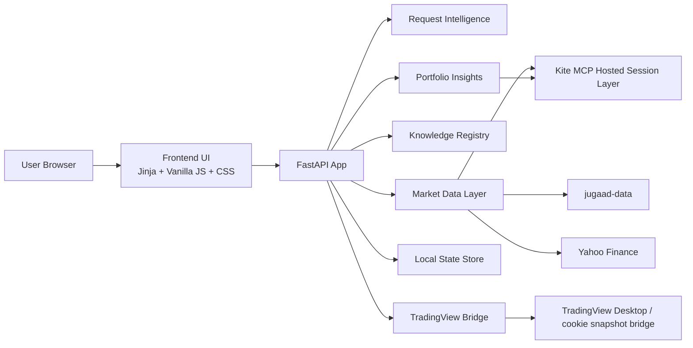
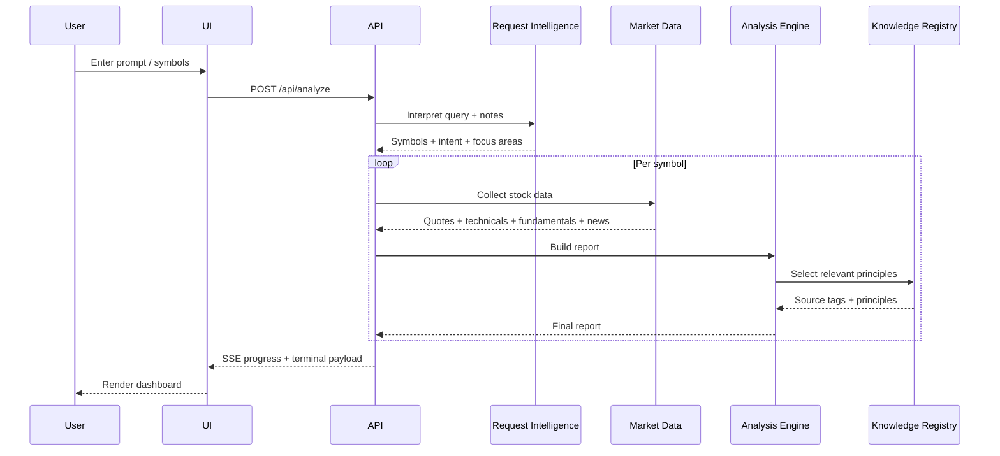
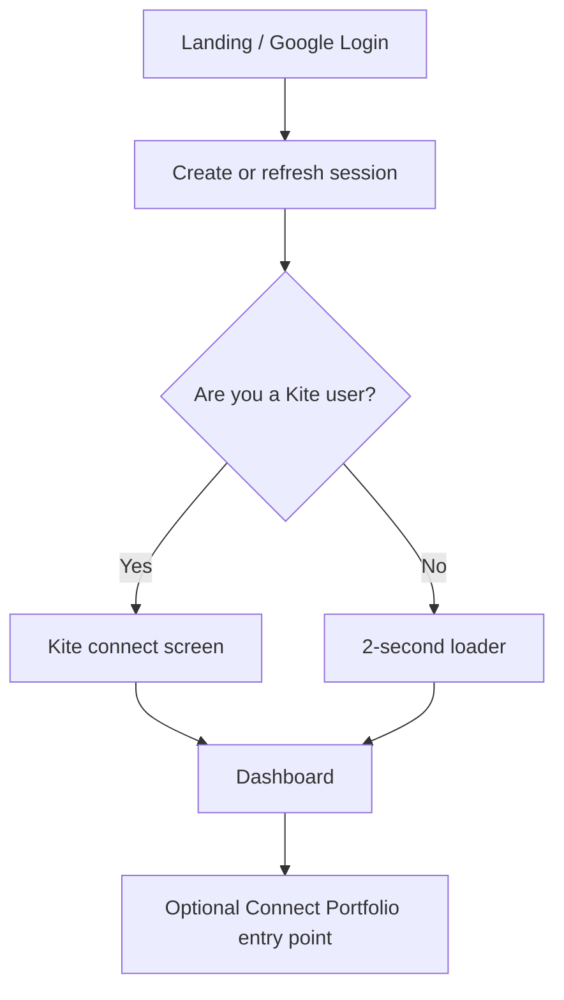

# Project Architecture

## Product Summary

`Personal AI Trader` is a local-first stock research workspace with:

- auth-first onboarding
- optional Kite portfolio connectivity
- provider-aware market data
- structured stock analysis and comparison
- a knowledge-backed reasoning layer
- portfolio insights when holdings data is available

The product is designed so analysis remains useful without broker connectivity.

## High-Level Architecture

## Frontend

The frontend is server-rendered at the shell level and client-side rendered for interactions/results.

### Main responsibilities

- auth, onboarding, and dashboard state transitions
- analysis form handling
- live progress feed using server-sent events
- rendering dashboard modules, comparison views, and stock cards
- profile menu and feedback drawer interactions

### Key files

- `app/templates/index.html`
- `app/static/app.js`
- `app/static/styles.css`

## Backend

The backend is a FastAPI app with a service-oriented structure.

### Main responsibilities

- route handling
- signed local session cookies
- job orchestration and event streaming
- provider-chain market data resolution
- analysis scoring and report assembly
- optional portfolio insight generation
- local-first persistence for user state

### Key files

- `app/main.py`
- `app/jobs.py`
- `app/models.py`
- `app/config.py`

## Service Layer

### `market_data.py`

Handles:

- symbol normalization
- NSE-first mapping
- quote-source attribution
- provider fallback logic
- price history, technicals, fundamentals, and news context assembly

Provider order today:

1. Kite MCP
2. jugaad-data
3. Yahoo Finance

### `analysis_engine.py`

Handles:

- swing scoring
- long-term scoring
- risk scoring
- return framework generation
- final label selection
- comparison ranking
- reasoning-source tagging from the knowledge registry

### `request_intelligence.py`

Handles:

- turning rough text into symbols
- compare-mode detection
- time-horizon inference
- focus-area extraction
- structured thinking/checklist generation

### `auth_service.py`

Handles:

- session cookie signing and verification
- Firebase readiness checks
- local dev fallback auth
- user bootstrap payloads

### `app_state.py`

Current persistence layer for:

- users
- preferences
- search history
- watchlists
- feedback queue
- Kite connection metadata
- portfolio snapshots

### `kite_bridge.py`

Current role:

- direct hosted Kite MCP session management
- login-link creation while preserving Zerodha consent flow
- instrument search
- quotes, holdings, and positions retrieval for connected users

### `portfolio_service.py`

Builds:

- total value and P&L
- concentration view
- diversification view
- sector allocation
- gainers/losers
- conviction/risk overlays

### `knowledge_registry.py`

Maintains source metadata for:

- product specs
- research playbooks
- books and frameworks

The registry feeds principle selection into each stock report.

## Data Flow

## Onboarding Flow

## Auth System

Current mode:

- Google sign-in when Firebase is configured
- local dev fallback when Firebase is not configured
- signed session cookie for persistence

Future production mode:

- Firebase client auth in frontend
- Firebase admin token verification in backend
- persistent user records in Postgres or Firestore-backed profile flow

## Database Structure

Current runtime storage:

- local JSON file through `app_state.py`

Planned persistent storage:

- PostgreSQL for users, preferences, search history, watchlist items, portfolio snapshots
- Firestore for feedback events

Current migration scaffold lives in:

- `infrastructure/postgres/migrations/001_core_tables.sql`
- `infrastructure/postgres/migrations/002_history_and_watchlist.sql`
- `infrastructure/postgres/migrations/003_feedback_and_portfolio.sql`

## Feedback System

Current mode:

- feedback is submitted from the in-app drawer
- backend stores entries locally
- payload includes route, user id, and whether the user is Kite-enabled

Future mode:

- same submission UX
- persistence routed to Firestore
- optional admin review queue

## Deployment Architecture

### Recommended current path

- Vercel for the FastAPI monolith

### Scaling-ready future path

- static/frontend hosting on Vercel or Firebase Hosting
- backend on a Python API service
- Postgres for persistence
- background workers for long-running jobs

## Technical Decisions

### Why FastAPI + Jinja + vanilla JS today?

- fast iteration
- minimal build tooling
- local-first simplicity
- easy to keep the project readable during product discovery

### Why keep Kite optional?

- reduces onboarding friction
- preserves usefulness for non-Kite users
- lets analysis stand on its own

### Why keep provider visibility explicit?

- easier debugging
- better user trust
- less ambiguity when fallback providers take over

## Known Limitations

- local JSON persistence is not horizontally scalable
- in-memory jobs do not survive restarts
- Kite login still requires the user to complete Zerodha auth in the browser
- server-side rendering plus vanilla JS is workable now but will become harder to scale than a component framework once the product grows significantly
